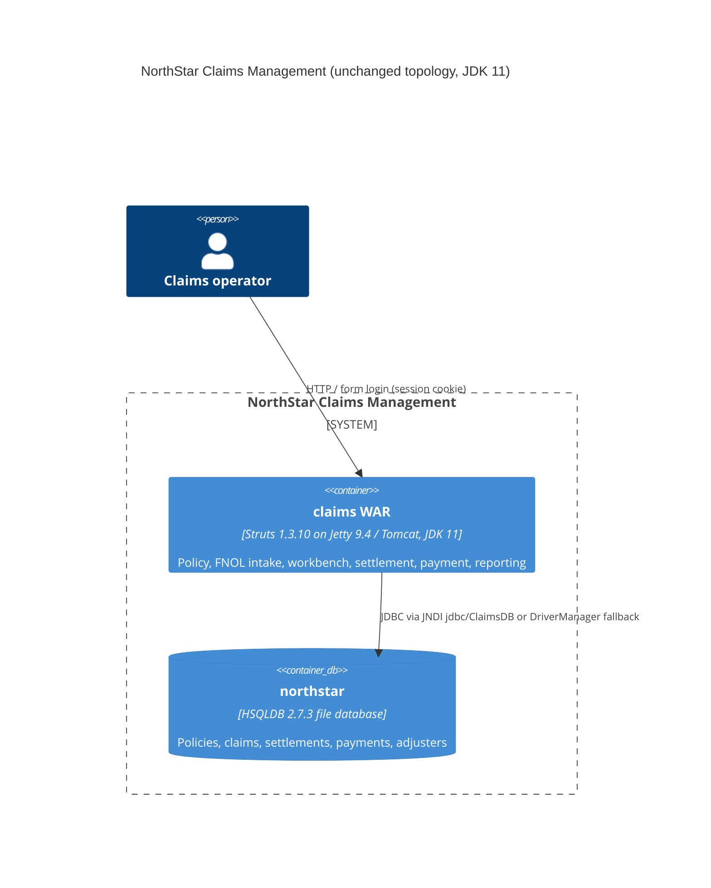

# 0001. Upgrade NorthStar Claims compile target and runtime from Java 7 to Java 11

- **Status:** Proposed
- **Date:** 2026-09-24
- **ARB ticket:** TO BE CREATED
- **Authors:** Devin (on behalf of the NorthStar Claims maintainers)
- **Owning team:** TBD — owner to confirm before ARB
- **Related ADRs:** none (first ADR in this repository)

## Context

NorthStar Claims Management is a Struts 1.3.10 WAR compiled with
`-source 7 -target 7` (pom.xml, build.xml). Java 7 has been end-of-life since
2015 and is no longer supported by current tooling. The GitHub Actions
pipeline already provisions Temurin JDK 11, so the application is already
built and exercised on an 11 runtime; only the compile target lagged behind.
This change aligns the Maven and Ant builds with the Java 11 LTS release.

No dependency versions, servlet/JSP API levels, data stores, external
integrations, or auth/network boundaries change. Source code required no
modification: the codebase does not use `sun.misc.*`, `sun.reflect.*`,
`javax.xml.bind`, `javax.xml.ws`, or other Java EE modules removed by JEP 320.

ARB triggers: T7 (runtime / language major upgrade, Java 7 -> Java 11).
Not triggered: T1, T2, T3, T4, T5, T6, T8, T9.

## Decision

We will compile NorthStar Claims Management for Java 11 (`<release>11</release>`
in Maven, `source="11" target="11"` in Ant) and treat JDK 11 as the minimum
supported build and runtime version, without adopting the Java Platform Module
System and without changing application dependencies.

## Alternatives considered

| Alternative | Pros | Cons | Why rejected |
| --- | --- | --- | --- |
| Do nothing (stay on `-target 7`) | Zero change | Java 7 EOL; `--release 7` unsupported by JDK 12+ compilers, blocking future toolchain upgrades; CI already runs on JDK 11 so the declared target is misleading | Accumulates toolchain debt with no benefit |
| Upgrade directly to Java 17 or 21 | Longer support horizon | Struts 1.3.10 / Servlet 2.4 / Jetty 9.4 stack untested there; `--release 7` bytecode from Ant path impossible; larger blast radius for a legacy baseline | Out of scope; the requested target is 11 and the README states this repo is the frozen legacy baseline |
| Upgrade to Java 11 plus modernize dependencies (Struts 2, Jetty 10, Servlet 4) | Removes more legacy | Rewrites a baseline the README explicitly says must not be modernized in place; would invalidate the deterministic transcript fixtures | Contradicts repository charter |

## Architecture

No new components, data stores, or external dependencies are introduced.

## Non-functional requirements

| NFR | Target | How met |
| --- | --- | --- |
| Availability SLO | Unchanged from current deployment — TBD, owner to confirm before ARB | No topology change |
| p95 latency | Unchanged — TBD, owner to confirm before ARB | Same code, same container; JDK 11 G1 default GC |
| RPO / RTO | Unchanged — HSQLDB file DB per RUNBOOK | No data-store change |
| Peak load | Unchanged — TBD, owner to confirm before ARB | N/A |
| Scaling model | Single WAR per container (unchanged) | N/A |
| Data retention | Unchanged | N/A |

## Security & compliance

- **Data classification:** unchanged (claims / policy business data, adjuster credentials).
- **Encryption at rest:** unchanged (HSQLDB file, no encryption — pre-existing known issue).
- **Encryption in transit:** unchanged (container-terminated TLS where deployed).
- **AuthN / AuthZ:** unchanged (Struts form login, `AuthenticationFilter` on `*.do`).
- **Secrets:** none added.
- **Audit logging:** unchanged (`ScreenAudit`, commons-logging).
- **Data residency / regions:** unchanged.
- **Policy sections satisfied:** N/A — no cloud infrastructure defined in this repository.
- **Threats considered:** JDK 11 receives security patches; Java 7 does not. Net risk reduction.

## Cost

| Item | Assumption | Monthly estimate |
| --- | --- | --- |
| JDK licensing | OpenJDK/Temurin, no license fee | $0 |
| **Total** | | $0 (no new recurring spend) |

## Operations

- **On-call rotation:** unchanged — TBD, owner to confirm before ARB.
- **Runbook:** docs/RUNBOOK.txt (Tomcat/WebSphere hosts must provide JDK 11+).
- **Dashboards / alarms:** unchanged.
- **Rollback plan:** revert the commit; class files return to major version 51 and run on any JDK >= 7.
- **Migration / cut-over plan:** ensure Tomcat/WebSphere hosts run JDK 11+ before deploying the next WAR; CI already builds on JDK 11.

## Policy exceptions requested

| Rule | Resource | Justification | Compensating control | Expiry |
| --- | --- | --- | --- | --- |
| none | | | | |

## Consequences

- Positive: supported LTS runtime; compiler warnings about obsolete `-source 7` removed; bytecode (major 55) matches the JDK CI already runs.
- Negative / risks: hosts still on JDK 7/8 cannot load the WAR (UnsupportedClassVersionError). Ant `source/target` (rather than `release`) is used so the historical Ant 1.7 build file still parses.
- Follow-ups: confirm production Tomcat/WebSphere JDK levels; later consider Java 17/21 in a separate ADR.

## Open questions

- Owning team, on-call rotation, and SLO figures are TBD — owner to confirm before ARB.
- Which deployment hosts (Tomcat/WebSphere) are still on a JDK below 11?
